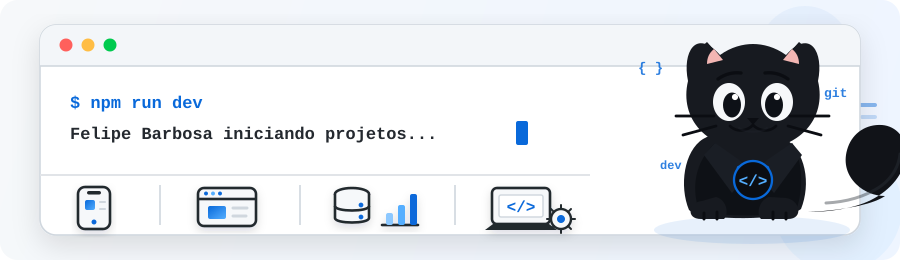

# 💻 Felipe Barbosa

**`Estudante de Engenharia de Software | UFAM`**

Olá! Sou Felipe Barbosa, estudante de Engenharia de Software.Tenho interesse em desenvolvimento de software, resolução de problemas, mobile e web além de me aprofundar nas áreas de dados.
Atualmente me dedico ao desenvolvimento de projetos pessoais.

---

### 🚀 Tecnologias e Ferramentas

 
 

---

### 🐈‍⬛ Modo Dev

  

---

### 🚧 Sempre aprendendo e evoluindo

